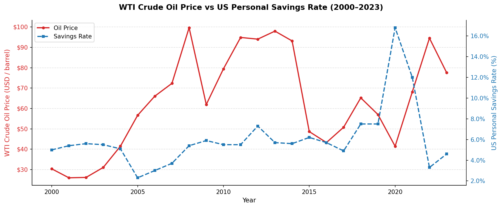
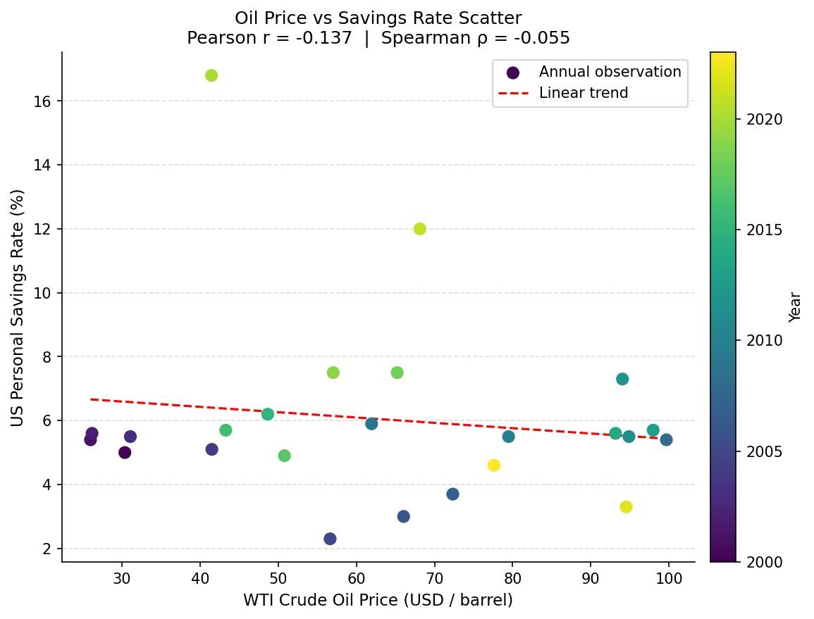
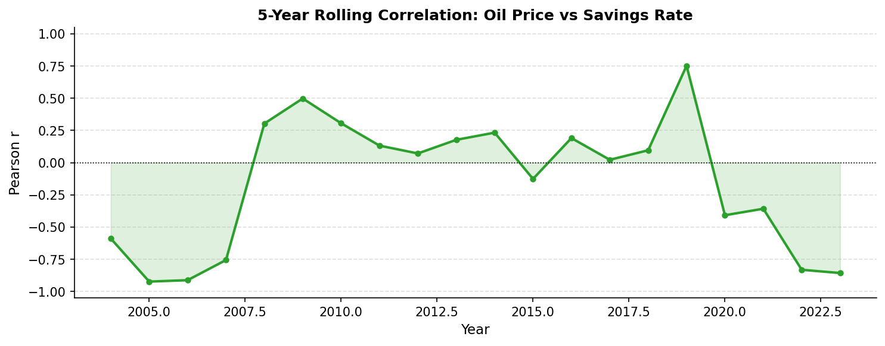

# Oil-Savings-Nexus

Analyses the statistical correlation between **WTI crude oil prices** and the
**US personal savings rate** using annual data from 2000 to 2023.

## Key findings (2000–2023 dataset)

| Metric | Value |
|--------|-------|
| Pearson r | −0.137 (p = 0.52, not significant) |
| Spearman ρ | −0.055 (p = 0.80, not significant) |

Over the full period the overall linear correlation is negligible. However,
the **5-year rolling correlation** reveals that the relationship is
time-varying: strongly negative in the early 2000s and again post-2021,
yet briefly positive around 2008–2009 and 2019 — reflecting the
outsized impact of macro shocks (the Global Financial Crisis and COVID-19)
on both variables.

## Charts

| Time Series | Scatter | Rolling Correlation |
|---|---|---|
|  |  |  |

## Project structure

```
Oil-Savings-Nexus/
├── main.py               # Entry point — runs full analysis
├── requirements.txt      # Python dependencies
├── src/
│   ├── data.py           # Historical WTI & savings-rate data
│   ├── correlation.py    # Pearson / Spearman / rolling correlation
│   └── visualization.py  # Matplotlib chart functions
├── tests/
│   └── test_correlation.py
└── output/               # Generated charts (PNG)
```

## Usage

```bash
pip install -r requirements.txt
python main.py          # prints analysis summary and saves charts to output/
pytest tests/           # run the test suite
```